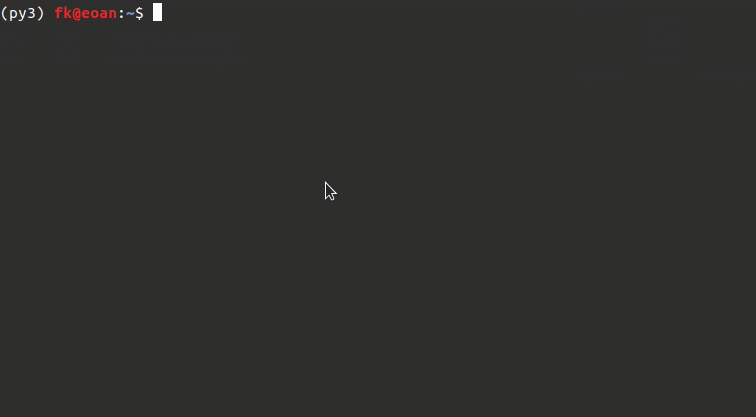

This is a patch for GDB that integrates [FZF fuzzy finder](https://github.com/junegunn/fzf) with GDB's history search.

FZF works with Bash history search out of the box. It uses Bash's `bind` builtin with the `-x` option. See `man bash`. This feature allows for binding arbitrary shell commands to keyboard shortcuts and, most importantly, it allows these commands to modify the `readline` prompt buffer.

GDB does not have such a feature, so customization is the only option.

This patch modifies GDB's `readline` module such that it calls into FZF when <kbd>Ctrl+R</kbd> is pressed, rather than the default reverse_search implementation. It works by forking FZF, piping GDB's history into it, reading the user's selection from FZF, then populating the readline prompt buffer with the selection.


# Installation

Download [GDB source code](https://ftp.gnu.org/gnu/gdb/). The latest version *probably* has the fewest bugs.

Grab my patch [gdb.patch](gdb.patch).

Extract, set up a local git repo then apply the patch.

```bash
tar xf gdb-*.tar.gz
cd gdb-*/
git init
git add .
git commit -m "initial commit"
git apply ../gdb.patch
```

If the patch fails to apply, the context lines in the patch file are probably different from the
source code. This could happen when the GDB version differs from the version used to create the
patch.

Check that the patch was applied.

```bash
git diff
git commit -m "fzf patch" # Commit the patch
```

How I build GDB.

```bash
# The build directory has to be outside of the source code root directory.
# So make sure to cd out of gdb-*/
cd ..
mkdir build
cd build
# Configure the build
# --prefix is the root directory to install resulting files at
# --enable-targets=all gives us support for all architectures
# $(which python) is the python venv that I have pwndbg installed in
../gdb-*/configure \
    --prefix=$(pwd) \
    --with-python=$(which python) \
    --enable-targets=all
# This should get all the build dependencies
apt build-dep gdb
# ~5 minutes first time.
# gdb binary should appear in bin/ of the build directory
make -j $(nproc) && make install
```

Customize FZF options with the environment variable `GDB_FZF_OPTS`.

```bash
# E.g., change the layout
export GDB_FZF_OPTS='--layout=reverse-list'
```

Set up infinite GDB history. Should be added to `~/.gdbinit`.

```gdb
# https://stackoverflow.com/a/3176802/6824752
set history save on
set history size unlimited
set history remove-duplicates unlimited
set history filename ~/.gdb_eternal_history
```
